<div align="center">

# PDF Translation

**把英文文献翻译成排版精美的中文 PDF**

公式重排、图片归位、表格重建、脚注可跳转 —— 不是把 PDF 转成文本再翻译，而是**重建一份中文版面**

[](https://claude.com/claude-code)
[](https://github.com/deepseek-ai)
[](LICENSE)

[English](README.en.md) · 中文

</div>

---

## 这是什么

一个 **agent skill**：把它装进 Claude Code 或 DSH，然后说一句「翻译这篇 PDF」，它就会产出一份**中文排版稿**。

它解决的是一件很具体的事：**现成的工具链都把公式毁了**。

把 PDF 转成 Markdown 再翻译，公式只有两条路可走 —— 要么拍平成 Unicode（丢掉分数线、根号、上下标位置），要么裁成图片（不能缩放、基线和中文对不齐，一眼看上去就是贴上去的）。两条路都把一个**已经排好的公式**给毁了。

这个 skill 走第三条路：**用 KaTeX 把公式重新排一遍**。输出的是真正的矢量字形（`KaTeX_Math-Italic`、`KaTeX_Size2-Regular` 这些字体子集），能缩放、能对齐、能打印。

社区里目前没有同类开源方案，而文献翻译是很多人的日常刚需 —— 所以把它放出来。

---

## 效果

### 1. 修复原文的文字重叠

有些 PDF（尤其是排版引擎生成的）文字层会互相叠在一起，直接提取出来是一团乱码。工具会按字形位置重新归位。

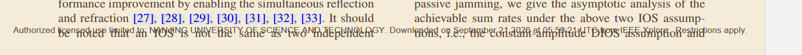

### 2. 图片：按原文的跨栏方式归位

原文里跨两栏的图（(a) 在左栏、(b) 在右栏、题注横跨），译文里**照样跨两栏**，两个子图各占一栏 —— 而不是缩成半宽塞进一栏。题注也逐句翻译。

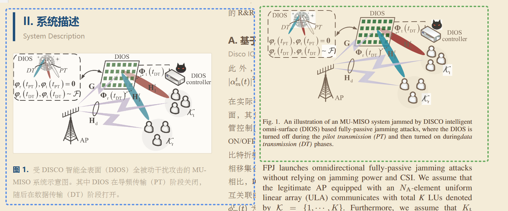

### 3. 表格：重建单元格，不是截图

原文是**矢量轮廓**的表格（文字层是空的）也能重建。表头、对齐、跨栏与否都按原文来。

<table>
<tr><th>原文</th><th>译文</th></tr>
<tr>
<td>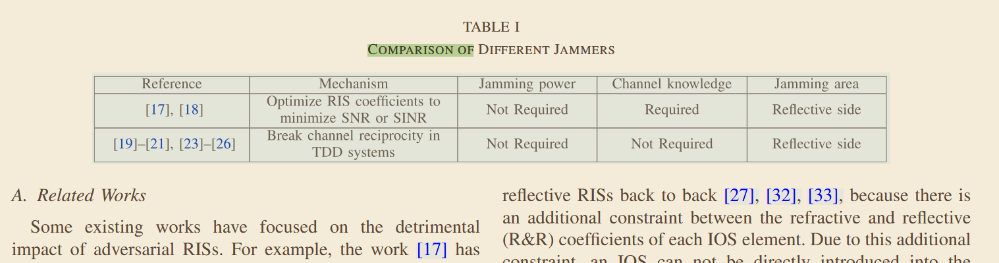</td>
<td>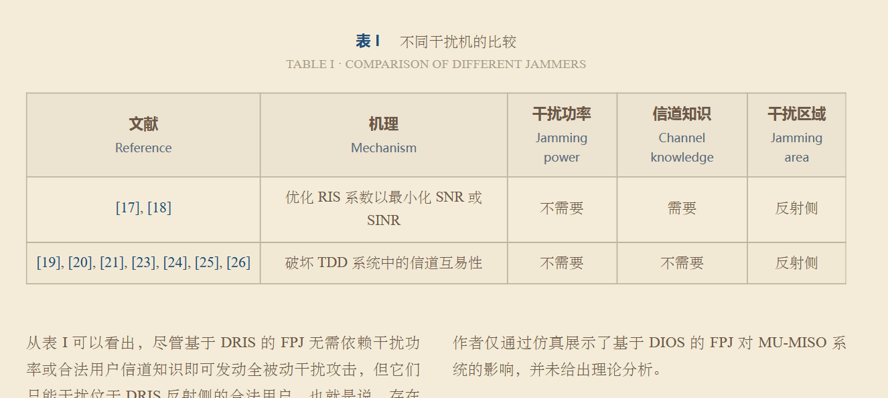</td>
</tr>
</table>

### 4. 标题：中英对照，层级照旧

标题保留英文原题，中文为主、英文为辅，字号与层级关系按原文还原。

<table>
<tr><th>原文</th><th>译文</th></tr>
<tr>
<td>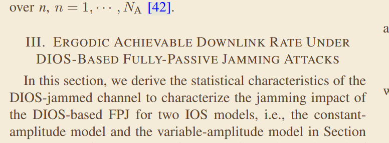</td>
<td>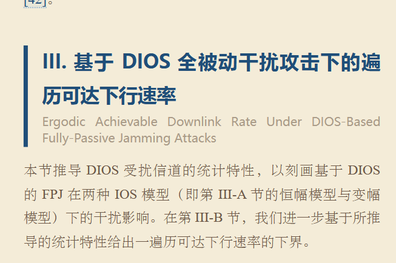</td>
</tr>
</table>

### 5. 公式：重新排版，不是裁图

绝大多数公式能**逐符号还原**，包括多层上下标、大型运算符、分式与定界符。

<table>
<tr><th>原文</th><th>译文</th></tr>
<tr>
<td>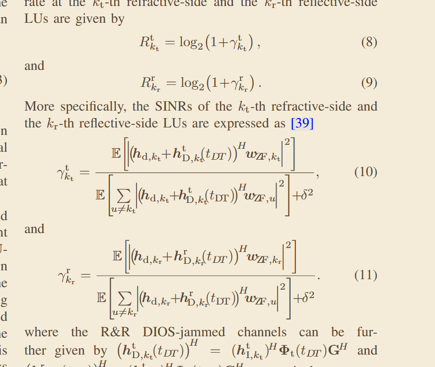</td>
<td>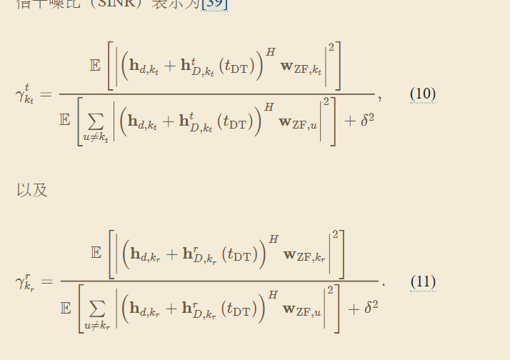</td>
</tr>
</table>

复杂的嵌套公式会有**字符与断行上的差异** —— 比如根号内的括号层级、换行位置 —— 但数学含义不变，不影响阅读。

<table>
<tr><th>原文</th><th>译文</th></tr>
<tr>
<td>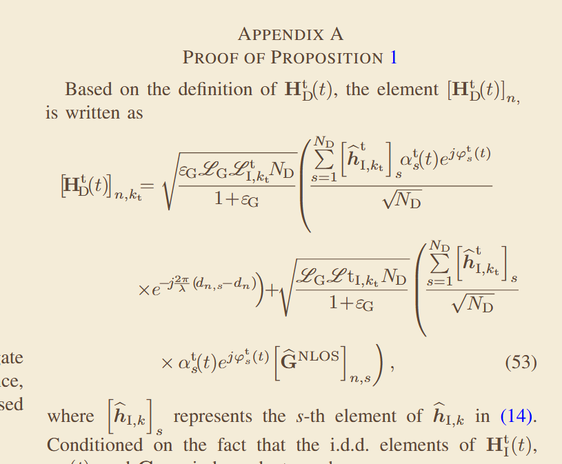</td>
<td>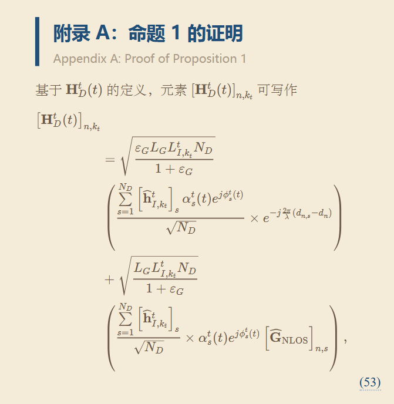</td>
</tr>
</table>

### 6. 脚注：翻译 + 双向跳转

原文把脚注排在引用页页脚，译文集中放在文末（Chrome 的 CSS 至今没有实现 `float: footnote`，无法做到真正的页脚脚注）。但**点击正文的上标可以跳到脚注，点击脚注末尾的 ↩ 可以跳回正文**。

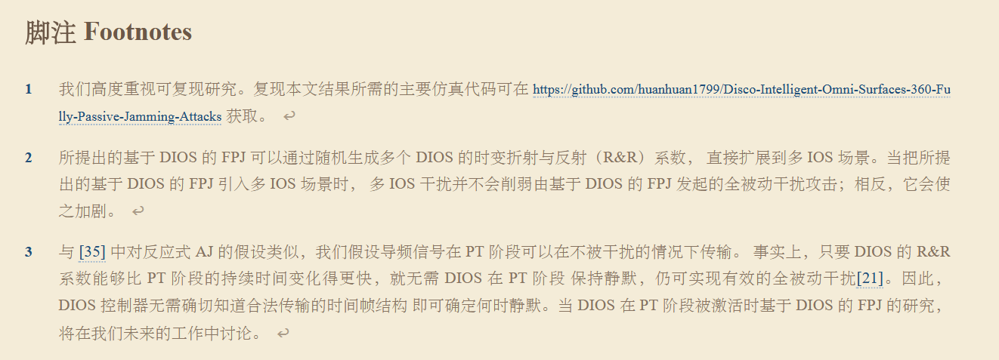

### 7. 保留原文的引用跳转

正文里的 `[n]` 全部变成可点击链接，指向文末对应的参考文献条目。鼠标悬停即可预览。

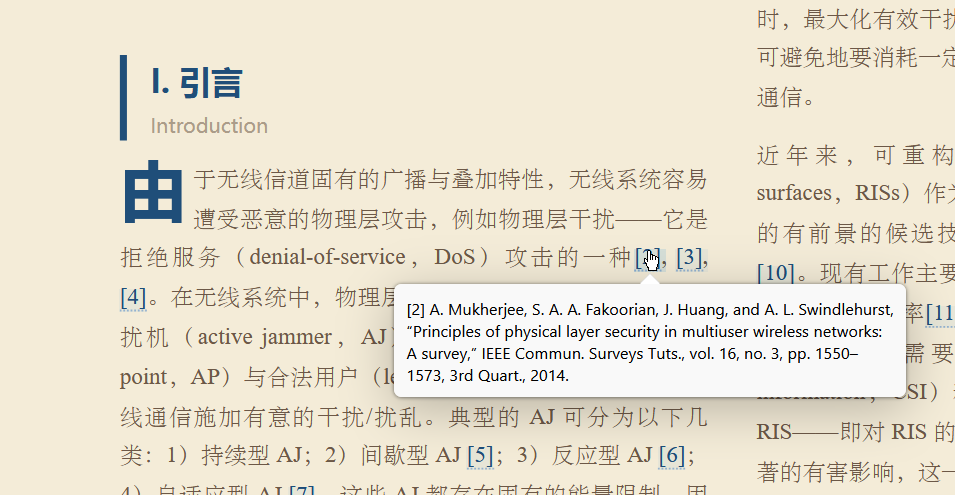

### 8. 参考文献不翻译

作者名、刊名、卷期、DOI 是**书目数据**，翻译会破坏可检索性与 CrossRef 匹配。所以原样提取、重新排版、单独成页。

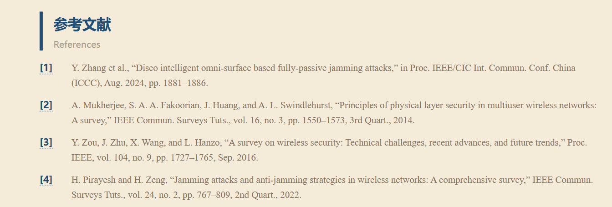

### 9. 标题与摘要

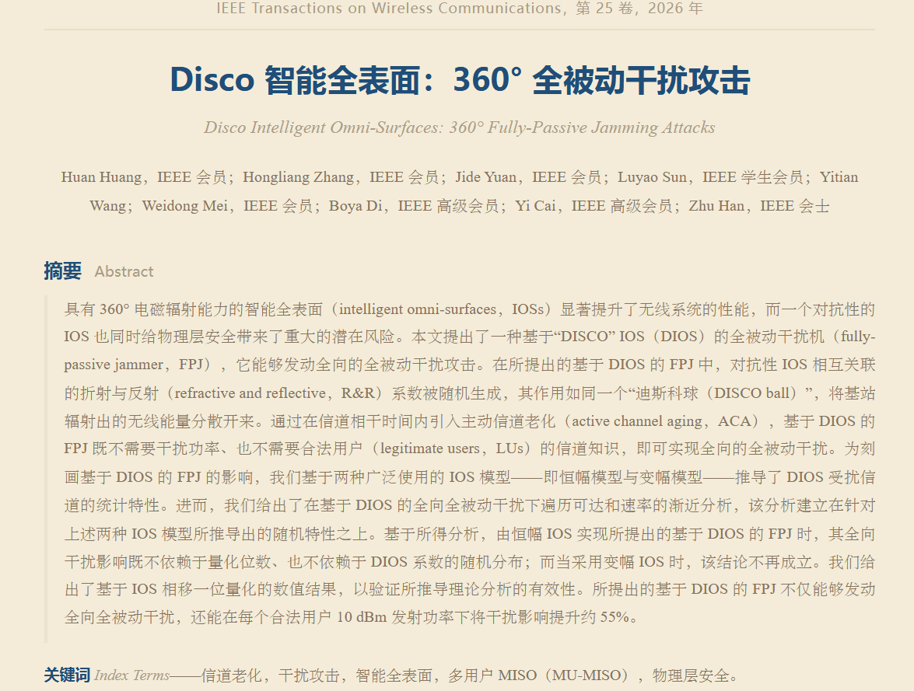

---

## 工作原理

六个阶段，前三个和第六个是脚本，中间是模型自己的活。

```
0. ask        → 先问你：只要 Markdown，还是要排版好的 PDF？报出预估 token 与耗时
1. probe      → 这个 PDF 有文字层吗？哪些页需要 OCR？
2. extract    → 逐页取出文本块 + 坐标 + 字体字号，图片按 300 dpi 裁出
3. classify   → 哪些片段是公式，哪些块是标题 / 代码 / 题注
4. translate  → 模型写中文，产出结构化的正文文件
5. verify     → fidelity.py：有没有漏句、有没有把题注写成摘要
6. typeset    → HTML + KaTeX → headless Chrome → PDF，再盖章页眉页脚
```

选「只要 Markdown」的话，跑完第 5 步就结束，跳过整个排版环节 —— **成本大约只有四分之一**。

### 为什么是 HTML + CSS，不是 LaTeX

设计迭代就是改一行 CSS，几秒钟出结果；LaTeX 要先装 MiKTeX。中日韩断行和字体回退交给浏览器处理，比 xeCJK 省事。LaTeX 适合你自己从零写一篇数学密集的文档；这里做的是**重建别人已经排好的版面**，CSS 是更便宜的工具。

---

## 安装

### 前置条件

| 依赖 | 说明 |
|---|---|
| **宿主 agent** | [Claude Code](https://claude.com/claude-code) 或 [DSH](https://github.com/deepseek-ai)。翻译由 agent 的模型完成 |
| **Python 3.9+** | 需要 `pymupdf`：`pip install pymupdf` |
| **Chrome 或 Edge** | 用来打印 PDF。装在标准路径即可，否则设 `CHROME_PATH` 环境变量 |
| **中文字体** | 正文 `STSong` / `SimSun`，标题 `Microsoft YaHei`（Windows 自带；macOS/Linux 见下方 FAQ） |

### 装 skill

把仓库放进 agent 的 skill 目录：

```bash
git clone https://github.com/DFBlowing/pdf-translation.git

# Claude Code
cp -r pdf-translation ~/.claude/skills/

# DSH
cp -r pdf-translation ~/.dsh/skills/
```

然后在会话里说「翻译这篇 PDF」即可触发；也可以直接 `/pdf-translation`。

---

## 使用

### 它会先问你三个问题

**在动手之前**，它会先量一遍你的文档，把成本摆出来让你选：

> 这份 PDF 共 **14 页 / 9,932 个英文词 / 72 个编号公式**（公式密集）。
>
> - **只出 Markdown**：约 **15–25 分钟**，**2 万–4 万 token**（跳过排版与迭代）
> - **出排版好的 PDF**：约 **60–100 分钟**，**4 万–7 万 token**
>
> 要哪一种？要 PDF 的话，正文和图片分别要单栏还是双栏？

预估不是拍脑袋：脚本会实测页数、英文词数、编号公式数，再套用**在真实论文上标定过的系数**（汉字数 ≈ 英文词数 × 0.94，参考案例预测 9,336 字 vs 实际 9,329 字）。

### 使用条件

**适合：**

- 有**文字层**的学术 PDF（期刊论文、会议论文、讲义、教材）
- 单栏或双栏排版
- 公式、图片、表格、参考文献、脚注

**不适合：**

- **扫描件 / 影印本** —— 没有文字层，需要先做 OCR（工具会明确告诉你）
- 公式本身是**图片**的文档（老论文扫描版常见）
- 图文混排的杂志、手写体、竖排文字

### 单栏还是双栏？

这是**必须问**的，不是默认项。它决定 CSS 架构、图片标记方式和公式越界判据，事后返工要重跑整个流程。

如果原文是双栏期刊（IEEE / ACM / Elsevier），skill 会去读 `references/two-column-paper.md` —— 里面有实测的栏几何、逐段分栏架构、越界判据及其两个已经踩过的坑、图片与表格的跨栏规则。

---

## 常见问题

### 需要配置 API key 吗？

**这个 skill 本身不需要任何 key。**

翻译是**宿主 agent 用它自己的模型**做的 —— key 配在 agent 里，不在 skill 里。你只要保证 Claude Code 或 DSH 能正常对话，就能用它。

需要配置的只有几个**可选项**：

```bash
# 可选：Chrome 不在标准路径时
export CHROME_PATH="/Applications/Google Chrome.app/Contents/MacOS/Google Chrome"

# 可选：macOS / Linux 上的中文字体（见下一条）
export PDF_TRANSLATION_SERIF="Songti SC"          # 正文
export PDF_TRANSLATION_SANS="PingFang SC"         # 标题
```

### macOS / Linux 上的中文字体

默认字体名是 Windows 的 `STSong` / `SimSun`（正文）和 `Microsoft YaHei`（标题）。其他平台用上面两个环境变量覆盖即可，**不需要改代码**：

| 平台 | `PDF_TRANSLATION_SERIF` | `PDF_TRANSLATION_SANS` |
|---|---|---|
| Windows | `STSong`（默认） | `Microsoft YaHei`（默认） |
| macOS | `Songti SC` | `PingFang SC` |
| Linux | `Noto Serif CJK SC` | `Noto Sans CJK SC` |

页眉页脚是脚本用 PyMuPDF 盖的章（不走 Chrome），所以它需要一个**字体文件**而不是字体名。脚本会自动探测常见路径，也可以用 `PDF_TRANSLATION_FONT_DIR` 指定目录。

### 为什么脚注不放在页面底部？

Chrome 至今**没有实现** CSS GCPM 的 `float: footnote`（`position: running()` 只管页边元素）。用单向 HTML 流模拟会遇到「引用点位置随分页变化」的循环依赖，只能多轮渲染逼近，非常脆弱。所以脚注集中在文末，用**双向跳转**补上体验。真要贴页得换 LaTeX 重排，那是另一条技术栈。

### 公式会不会排错？

绝大多数不会。复杂嵌套公式可能有字符或断行上的差异（见上文第 5 条）。**但比「拍平成 Unicode」和「裁成图片」好得多** —— 那两种做法是必然出错，不是可能出错。

---

## 目录结构

```
pdf-translation/
├── SKILL.md                        主流程与设计决策
├── references/
│   └── two-column-paper.md         双栏期刊版式：栏几何、分栏架构、越界判据
├── scripts/
│   ├── estimate.py                 阶段 0 — token 与耗时预估
│   ├── probe.py                    阶段 1 — 页数/块数/字号直方图
│   ├── extract.py                  阶段 2 — structure.json + 300dpi 图片
│   ├── classify.py                 阶段 3 — 公式片段 + 标题层级
│   ├── fidelity.py                 阶段 5 — 漏译/未译/题注闸门
│   ├── typeset.py                  阶段 6 — HTML + KaTeX + Chrome → PDF
│   └── compare.py                  对比任意两份 PDF
└── docs/images/                    README 用的效果图
```

---

## 已知限制

- **公式密集的文档要多轮迭代。** 修好一批公式后分页会变，可能暴露新的越界，所以要循环到收敛。这是工具会如实汇报成本的原因。
- **分栏的末页可能参差。** Chrome 对含高不可分割块的多页分栏段不做末页均衡，CSS 层面无解。彻底解决要换 LaTeX 重排。
- **脚注无法贴页**（见 FAQ）。
- **页眉页脚是脚本盖的章**，不是原文版面。

---

## License

[MIT](LICENSE)

效果图来自 IEEE TWC 2026 的一篇公开论文，仅用于演示排版能力。
